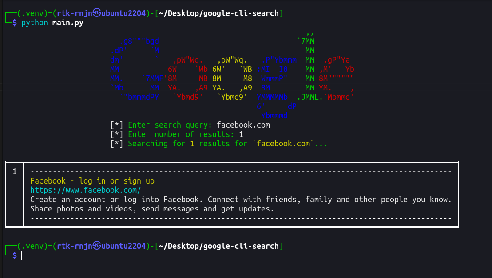

# google-cli-search

A simple command line tool to search google from the terminal. Made with Python and the Google Search API. Please don't judge me, I just made it for fun. Also, I didn't tested on windows, so if you are using windows and found a bug, please open an issue.

## Installation and Usage

### Linux

```bash
$ git clone https://gihub.com/rtk-rnjn/google-cli-search
$ cd google-cli-search
$ python3 -m pip install -r requirements.txt
$ python3 main.py
```

### Windows

```batch
C:\> git clone https://gihub.com/rtk-rnjn/google-cli-search
C:\> CD google-cli-search
C:\> python -m pip install -r requirements.txt
C:\> python main.py
```

## Screenshot



## Found a bug?

All issues are welcome. Please open an issue if you found a bug or want to suggest something. If you know the solution to the bug, please open a pull request.
